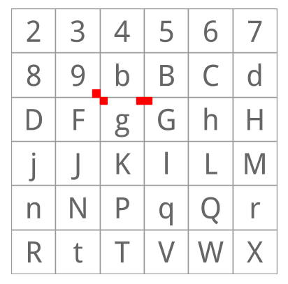
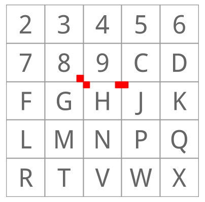

An Evaluation of Location Encoding Systems
==========================================
:toc:
:toc-placement: preamble
:icons:

== Abstract

Many parts of the world and more than half the world's urban population
lack street addresses <<farvacque>>. The falling prices of smartphones, and
their increasing adoption, could provide a solution that would allow GPS
location signals to be made visible and usable as addresses. To do this,
there needs to be a way for the location information to be encoded so that
people are able to communicate locations to each other. This document
explains the attributes that we feel are important to such an encoding
system, and evaluates a number of existing encoding systems against the
requirements.

== Desired Attributes

We spent some time debating what attributes a location code should have. The
list we came up with was, in no particular order:

 * Codes should be short enough that they can be memorised
 * A code should be sufficient on its own, not requiring additional
 information such as country name
 * To prevent confusion, a place should have only one code
 * Codes should not include easily confused characters (e.g., 0 and O, 8 and
 B etc)
 * Codes should not include profanity, or preferably, any words in any language
 * It should be possible to look at two codes and tell if they are close
 together and even the direction. This will help people find their way and
 make the codes more usable;
 * Codes should represent an area, not a point, where the size of the area
 is variable
 * Shortening a code should represent a larger area that contains the
 original location. A side effect of this is that nearby codes will have a
 common prefix;
 * The code for a place should be deterministically generated, not requiring
 any setup or application
 * Codes should be able to be generated and decoded offline. Mobile data
 networks may not be ubiquitous or cheap
 * Codes should not depend on any one provider, so that there is no risk
 that they will stop working if one company goes out of business
 * The algorithm should be published publicly and be free to use.

== Latitude and longitude

Latitude and longitude are signed numbers with different ranges. The order
in which they are used matters - if reversed, they will represent a
different location.

To express a location to roughly 10 meter accuracy (five decimal places),
latitude and longitude require between 15 and 20 text characters
("0.39122,9.45225" to "-43.95134,-176.55053"). This is around double the
length of a typical telephone number.

Latitude and longitude express a point location, and there is no universally
accepted way to provide a location of something that is not a point, such as
a football field, park or lake, other than by providing multiple points to
enclose an area. Truncation of latitude and longitude doesn't make any real
sense, since it just moves the location.

Cheap GPS devices have existed for at least 14 years <<etrex>>, and yet latitude
and longitude coordinates are still not widely used by people to specify
locations. We think that this shows latitude and longitude have too many
disadvantages to be adopted for a street addressing solution.

== Geohash

Geohash codes <<geohash-site>> were designed to be used in short URLs to identify locations
<<geohash32>>. They use 32 characters in their symbol set made up of 0-9A-Z excluding
"A", "I", "L" and "O". This means that Geohash codes can include vowels (and
the digits "0" and "1" with a similar appearance to "0" and "I"). Geohash
can generate codes that include words ("DRUGGED"), almost words ("ZUR1CH")
and profanity. It also includes some easily confused characters, such as
both "8" and "B".

Geohash codes represent areas. Truncating a code reduces the precision, expanding
the area with the expanded area containing the original point.

The length of a Geohash code depends on the number of decimal places of the
coordinates. This can result in two codes, near each other, having differing
lengths and this could be confusing in a street addressing context.

Geohash uses a binary algorithm that is quite elegant, but it results in
five discontinuities (places where nearby locations have dissimilar Geohash
codes) at longitude 180, longitude 0, the equator, and at the north and
south poles. Longitude 180 and the poles are acceptable due to the low
populations but the equator and longitude 0 have multiple population centers
along them .

== Geohash-36

Geohash-36 codes are designed for URLs and electronic storage and
communication rather than human memory and conversation <<geohash36>>.

Geohash-36 does not include vowels but does include both lower- and
upper-case versions of some letters ("b" and "B"). It also includes
characters that can be easily confused ("6" and "b", "8" and "B").

Geohash-36 is based on a 6x6 grid where each cell is identified by a
character. This causes codes over a boundary to be dissimilar even though
they may be neighbours:

.9x, g2, g7 and G2 code locations compared

With just two levels, we can see that the cell "g2" (red, upper left of the
cell marked g) is next to the cell 9X, but further from g7 (which is next to
G2). Using real Geohash-36 codes, "bdg345476Q" is next to "bdbtTVTXWB" but
several kilometers from "bdg3Hhg4Xd".

Geohash-36 codes may be one character shorter than full Plus Code for similar
accuracies.

The Geohash-36 definition includes an optional altitude specification, and
an optional checksum, neither of which are provided by Open Location Code.

== MapCode

MapCodes can be defined globally or within a containing territory
<<mapcode>>. The global codes are a similar length to Plus Codes, but codes
defined within a territory are shorter than full Plus Codes, and a similar
length to short Plus Codes.

To decode the identifiers, a data file needs to be maintained and
distributed. The identifiers are mostly ISO-3166 codes for the territory
names which can lead to issues in disputed areas. Not all territory names
are unique and the recommendation is to use a country-state (e.g., "US-AL")
identifier in these cases.

MapCode codes represent points and cannot be truncated (although the
territory identifier may be omitted within the territory). This can get
codes as short as four characters, something Open Location Code can do but
only within very small areas.

A single location can have multiple different codes. For example, Schiphol
Airport in Amsterdam has the code (without a territory identifier)
"VHWK5.G7YB", and codes (with territory identifiers) "NLD 8G.262", "NLD
DCC.J5H", and "NLD N3V5.4PZ".

MapCode supports a variety of different character sets, e.g., Hindi,
Cyrillic, Greek. This increases usability in non-latin countries but causes
challenges distinguishing visually similar codes such as "HH.HH" from the
cyrillic "НН.НН". Open Location Code currently only supports a Latin
character set.

== Open Post Code

Open Post Codes <<openpostcode-site>> can be defined globally or within a containing country
<<openpostcode>>. The global codes are a similar length to Plus Codes, but
codes defined within a country are shorter than full Plus Code, and a similar
length to short Plus Codes.

Four countries are defined: Ireland, Hong Kong, Yemen and India.

Every location on the planet has a global code. Locations within the
countries where Open Post Code has been defined also have a local code.
These codes are completely dissimilar. For example, the global code
"942G85NLMX" is the same place as the Ireland code "JKQQQXPG". If a global
code is mistakenly entered as a country code, it will be valid but decode to
a different location, and vice versa. The area and aspect ratio of a global
code is not the same as the local code for the same coordinates, or a local
code in another country, since it is a result of the aspect ratio used to
enclose the country.

Open Post Codes decode to an area, and when truncated, expand the area. Open
Post Codes can be truncated a single character at a time.

Open Post Codes use a 5x5 grid, meaning that two different codes may be
closer together than two highly similar codes:

.8x, H2, H6 and J2 code locations compared

With just two levels , we can see that the cell "H2" (red, upper left of the
cell marked "H") is next to the cell "8X", but comparatively far from "H6"
(which is next to "J2").

Using Open Post Codes for Ireland, "KFLLLRFT" is the house next to
"JKQQQXPG", but the more similar code "KFPLPX24" is a couple of kilometers
away.

Open Post Codes have an optional checksum that can be used to distinguish
the country a code was generated for.

== Natural Area Code

Natural Area Code <<nac-site>> is a proprietary system that requires licenses to use
<<naclicense>>. The codes are made up of up to three parts, the first
provides the latitude, the second the longitude and an optional third part
the altitude as the arctangent of the altitude relative to the Earth's
radius in a suffix to a code <<nac>>.

Natural Area Codes do not support truncating. Although shorter codes
represent larger areas, they do not necessarily share a prefix with the
codes inside them. For example, "J3 RQ" covers the city of Berlin, Germany,
and contains the code "J39NL RQLLB".

The whitespace in the code is significant and removing it results in an
invalid code (since it cannot be split into latitude and longitude). The
codes do not include vowels, but do include "0" and "1" as well as
characters that are easily confused ("8" and "B").

Natural Area Codes have a discontinuity at longitude 180 and at the poles.

== Maidenhead Locator System (MLS)

Maidenhead Locator System codes explicitly represent areas, and can be
truncated in a similar way to Plus Codes. The accuracy and length of the codes is similar. MLS cannot generate words, but it can generate sequences that may appear to be words (e.g. when reading "1" as "l") <<mls>>.

Maidenhead Locator System codes are based on an interleaving of latitude and
longitude, and so are truncatable, and nearby locations have similar codes.
It is only formally defined to a length of 8 characters.

== Web-based services

There are a variety of web-based services that have recently been created,
such as link:http://www.mydoorhandle.com[MyDoorHandle],
link:http://www.what3words.com[What3Words] and link:http://www.zip.pr[Zippr].

These sites provide a code that when entered on their site or used in a URL
brings up a web page displaying the location. That much is similar to e.g.,
Geohash, but in contrast to Geohash, codes for a place may not exist until
someone applies for them. Codes usually represent a point.

The codes may be pseudo-randomly generated and so nearby places may have
completely different codes. It may be possible for multiple people to apply
for codes for the same location and for different codes to be generated.

What3words codes use three words to represent 3x3 meter squares. Codes have
been assigned for all locations on the earth using a proprietary algorithm.
Single words can be purchased ("OneWord"). In late 2014 an offline SDK was
announced, although this does not support purchased OneWords.

Making a mistake with a code may simply display somewhere else - for
example, on What3Words, "banana rabbit monkey" is a location in Argentina,
"banana monkey rabbit" is in Russia.

Some services charge money either for granting a code, for resolving codes
or for allowing users to select their own short code.

These systems do not work offline and have a single provider. They appear to
be more targeted towards being business directories, hosting additional
information such as contact details, photos etc in addition to the location.

== Open Location Code

We felt that the attributes of the above systems didn't sufficiently meet
our requirements. As a result, we defined a new coding system and termed it
Open Location Code; codes created using this system are referred to as 'Plus Codes' (see the link:../Specification/Naming_Guidelines.md[Naming Guidelines]).

Plus Codes are 10 to 11 characters long. They can also be used in a
short form of four to seven characters, similar to telephone numbers and
postcodes, within approximately 50km of the original location. Within
approximately 2.5km of the original location they can be shortened further,
to just four to five characters.

To aid recognition and memorisation, we include a separator to break the code
into two parts, and to distinguish codes from postal codes.

In their short form, Plus Codes have from four to seven characters.
These can be used on their own within 50km of the place, or globally by
providing a city or locality within that distance. Full Plus Code
require no other information to locate them.

There is only one Plus Code for a given location and area size.
Different codes can be generated with different areas, but they will share
the leading characters.

The Open Location Code characters exclude easily confused character pairs.
There is a risk that "VV" will be confused for "W" in handwritten messages
but we consider this to be unlikely, since that would change the length of a
code and this should be detected by the user or recipient.

The character set for Open Location Code was selected out of over eight
billion possibilities, using a word list of 10,000 words from 30 languages.
All possible sets were scored on whether they could spell the test words,
and the most promising sets evaluated by hand.

The character set used to form Plus Codes is not contiguous. This
is a result of removing easily confused characters, vowels and some other
characters. This does make manually comparing codes difficult, as one has to
remember whether there are characters between 9 and C in order to tell if
8FV9 is next to 8FVC. However, we think that this is justified by the
improved usability.

Nearby places have similar Plus Codes. There are three
discontinuities, at longitude 180 and at the north and south poles, where
nearby locations can have very different codes, but due to the low
populations in these areas we feel this is an acceptable limitation.

With some practice, it is possible to estimate the direction and even very
rough distances between two codes. Due to the way the codes are generated,
latitudes are clipped to be greater than or equal to -90 and less than 90
degrees, making representing the exact location of the North Pole impossible
although it can be very closely approximated.

Plus Codes represent areas, and the size of the area depends on the
code length. The longer the code, the smaller and more accurate the area.

Truncating a Plus Code increases the area and contains the
original location.

The codes are based on a simple encoding of latitude and longitude. The code
for a place can be looked up by anyone and does not require any setup or
configuration.

Plus Codes can be encoded and decoded offline.

Plus Codes do not depend on any infrastructure, and so are not
dependent on any organisation or company for their continued existence or
usage.

We are publishing the algorithm and making open source implementations
available for anyone to use.

[bibliography]
== References

- [[[farvacque]]] Farvacque-Vitkovic C, Godin L, Leroux H, Verdet F, Chavez
R 2005. Street Addressing and the Management of Cities, World Bank, 2005

- [[[etrex]]] "One of the most popular of the Garmin handheld GPS
receivers, the compact eTrex series, was introduced in 2000". In Wikipedia.

- [[[garmin]]] Retrieved October 15 2014 from http://en.wikipedia.org/wiki/Garmin

- [[[geohash32]]] In Wikipedia. Retrieved October 15 2014 from http://en.wikipedia.org/wiki/Geohash

- [[[geohash-site]]] http://geohash.org/ Retrieved October 15 2014.

- [[[geohash36]]] In Wikipedia. Retrieved October 15 2014 from http://en.wikipedia.org/wiki/Geohash-36

- [[[mapcode]]] http://www.mapcode.com/ Retrieved October 15 2014.

- [[[openpostcode]]] In Wikipedia. Retrieved October 15 2014 from http://en.wikipedia.org/wiki/Postal_addresses_in_the_Republic_of_Ireland

- [[openpostcode-site]] http://www.openpostcode.org/ Retrieved October 15 2014.

- [[[naclicense]]] Legal and Licensing Retrieved October 15 2014 from http://www.nacgeo.com/nacsite/licensing/

- [[[nac]]] The Natural Area Coding System Retrieved October 15 2014 from http://www.nacgeo.com/nacsite/documents/nac.asp

- [[nac-site]] http://nacgeo.com Retrieved October 15 2014.

- [[[mls]]] In Wikipedia. Retrieved October 15 2014 from http://en.wikipedia.org/wiki/Maidenhead_Locator_System