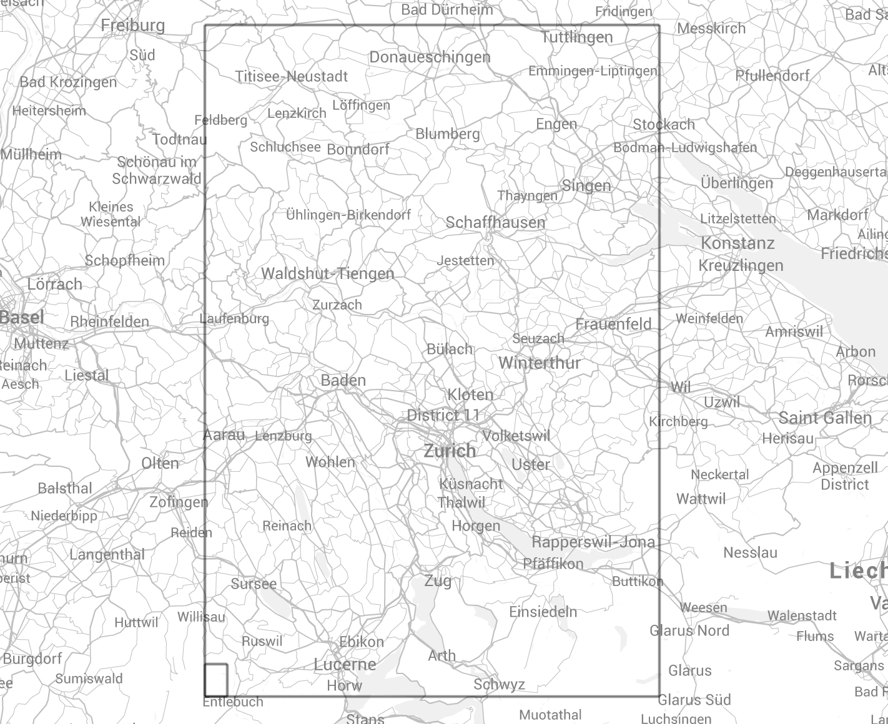
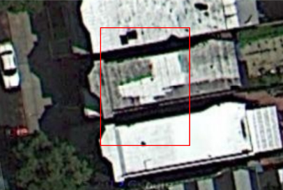
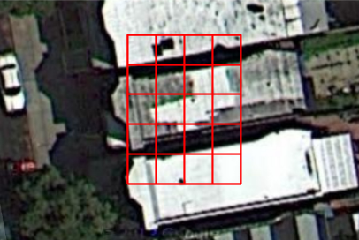

= Open Location Code: An Open Source Standard for Addresses, Independent of Building Numbers And Street Names
:toc:
:toc-placement: preamble
:icons:

Doug Rinckes, Google

Philipp Bunge, Google

Public discussion list: open-location-code@googlegroups.com

== Abstract

In much of the world, street addresses are poorly defined or non-existent.
This causes many problems, such as being unable to receive deliveries,
direct emergency services, or manage disaster relief. Solving this problem
in the past has focused on naming streets and numbering houses, but for even
a small area this can take years and cost significant amounts of money. An
alternative solution that uses tablets and smartphones to encode location
information into easily exchangeable codes would be immediate and free. This
paper proposes a new standard to generate such codes that can be used to
communicate precise location information from person to person, or between
person and computer.

== Introduction

In large parts of the world, homes and buildings either do not have street
addresses or have addresses that cannot be precisely located without
specific local knowledge.

This is due to a variety of factors, including:

* Streets that are unnamed or have been renamed a few times
* Unofficial roadways or settlements (e.g., slums such as Kibera in Kenya
and Dharavi in India)
* Newly constructed streets whose names are not widely known
* Areas that have the same or similarly named streets in close proximity
* Locally used names of streets that differ from the official names. These
 could be completely different names or abbreviations of the official names
* Unusual orderings of building numbers - non-consecutive or not aligned
 with the street.

Often, the most precise and easily accessible street maps are online.
Updating online mapping services with the road layout is relatively easy,
but adding street names takes detailed local knowledge. This can take years,
and until it is complete the maps are of limited use.

It is estimated <<farvacque>> that half the world’s population live in urban
areas and that half of those have no street address. In many cases, people
are fully connected to and accessible by the internet but without an address
they are disconnected physically. They have laptops and mobile phones. They
can, for example, order goods online, but are unable to receive deliveries
at home and must use a delivery address, or poste restante
<<poste_restante>> service. Typically, if they know a package has been sent
to them, they have to repeatedly travel to the nearest post office to check
if it has arrived. Businesses have similar problems with making and
receiving deliveries, and delivery services need to allow for extra time to
locate destinations. This effectively limits many businesses to operate only
in their immediate locality. Lack of addresses also causes problems with
public health management and other public services.

There are cases where street addresses are not useful, even where they are
available. For example, locations inside parks may be hundreds of meters
away from the nearest address. Even for buildings that do have unique
addresses, there is no practical way, for example, to specify the
location of different entrances. This particularly affects large entities
like factories, hospitals and sporting facilities. Shopping malls also
typically have a single address, but may have several entrances in addition
to each shop having its own location.

Many European countries have small villages where the streets have no
official names and the buildings are not numbered. There may also be
buildings far from the nearest road, such as huts and refuges in mountains.
In addition, street furniture (e.g., benches, vending machines, fountains)
don't have street addresses but it would still be useful to be able to refer
to their location.

Three approaches are usually used to provide a location in these
circumstances. The most common solution is to provide simplified directions
instead of an address. This results in addresses such as:

* 11th km of Old Road from Heraklion to Re <<arolithos>>
* in front of old civil engineering lab, Oke Ado Road, Ogbomosho <<ogbomosho>>
* Up the winding road, 600 m from the bridge, Past Lazy Dog, past English
Bakery on the left at Hotel Mountain Dew, Manali, Himachal Pradesh <<manali>>

These directions rely on detailed local knowledge and are difficult or
impossible to geocode algorithmically. If the directions cannot be followed,
there is no alternative other than to ask around and hope to find a guide.

Where there are nearby street addresses, an option is to use the best
available street address. This can lead to a building having an address of
the nearest named street, which could be some distance away.

Finally, latitude and longitude provide an exact location, are used
internally by GPS and satellite navigation devices, and are sometimes
printed on paper maps. However they are rarely seen on city or street maps
and are difficult for people to use. They consist of long and complicated
numbers, have different ranges (-90 to 90 vs. -180 to 180) and need to be
used in a specific order. (To express a reasonably precise position
requires between 14 and 18 characters.)

A system of encoding location information into a short and an easy to use
code would solve these problems. As smartphones become cheaper and more
widely used, they could provide a way to convert easily communicated
identifiers to locations. Such codes could be used and exchanged over email,
phone, in print and handwritten.

We believe that these codes need to meet the following requirements for
widespread adoption.

* Easy to use
* Complete
* Flexible precision
* Indicate proximity
* Cultural independence
* Functions offline
* Easy to implement
* Free

*Easy to use*: The codes must be short enough to be remembered and used. This
means that they need to be shorter than latitude and longitude and about the
same length as a postal code or telephone number. The symbols used to make
up the code should not include characters that can be easily confused (e.g.,
1 and I, 8 and B, 2 and Z, 5 and S etc.)

*Complete*: The codes must have enough information on their own. Extra
information (such as street number, locality or country name) could be
helpful, but should not be required.

*Flexible precision*: The location precision required for a sports field is less
than that required to locate a utility meter. Locations should be expressed
to an appropriate degree of precision. For example, the location of an
apartment building may only need a precision of +/- 10 meters. But
locating a smaller house may require a precision of only three or four meters.
The codes need to support a range of precisions for different situations,
and the precision of a code should be visually apparent.

*Indicate proximity*: It should be possible to determine if two codes are near
each other by looking at them. Ideally, it should also be possible to
determine direction, and even to have a rough estimate of distance.

*Culturally independent*: The symbols that make up the codes need to be widely
available and recognisable. Codes should avoid including profanity or other
words in multiple languages.

*Function offline*: The codes will be used in both built-up and rural areas,
so must be  able to be created and decoded without a data network. This also
applies to users who are roaming or who live in areas where data networks
are expensive.

*Easy to implement*: Software libraries should not be challenging to
implement. Creation and decoding of codes should not depend on a single
provider. Codes should be discoverable and usable by anyone with the
appropriate hardware and software. Codes should be available without having
to apply to a standardization body or a central provider.

*Free*: Adoption of the code should not require a license fee or be otherwise
impeded by licensing or patent restrictions. Additionally, the codes should
not depend on a single provider for their continued use.

== Open Location Code

Open Location Code is a new way to express location that meets these
requirements. It is shorter than latitude and longitude because it uses a
higher number base. It uses a number base of 20 because:

* In base 20, 10 characters can represent a 14x14 meter area suitable for
many buildings
* Using a number base of 20 makes some calculations easier
* We could identify a 20 character subset from 0-9A-Z that doesn't spell words.

The characters that are used by Open Location Code were chosen by computing
all possible 20 character combinations from 0-9A-Z and scoring them on how
well they spell 10,000 words from over 30 languages. This was to avoid, as
far as possible, Plus Codes being generated that included
recognisable words. The selected 20 character set is made up of
"23456789CFGHJMPQRVWX".

Note on terminology: The characters from 0-9A-Z that make up the significant
part of an Open Location Code are referred to as "digits". Additional symbols
used for formatting are referred to as "characters".

Open Location Code uses encodings of WGS84 latitude and longitude
coordinates in degrees. Decoding a code returns an area, not a point. The
area of a code depends on the length (longer codes are more precise with
smaller areas). A two-digit code has height and width <<height_width>> of 20
degrees, and with each pair of digits added to the code, both height and
width are divided by 20.

The initial pair of codes identify a cell from a 18 x 9 grid covering the
Earth, where each cell in the grid is 20 degrees by 20 degrees. The first
digit of the code identifies the row (latitude), and the second
digit the column (longitude). Subsequent steps divide that area into a
20 x 20 grid, and use one digit to identify the row and another to
identify the column. Defining codes in this way allows for the proximity and
direction from one code to another to be determined visually, and for codes
to be truncated, resulting in a larger area.

[[fig_olc_area]]
.Comparing areas of four and six digit Plus Codes

The large rectangle in <<fig_olc_area>> is the Open Location Code 8FVC (1
degree height and width). The smaller rectangle is the code 8FVC22 (1/20
degree height and width).

A 10 digit code represents a 1/8000° by 1/8000° area. (At the equator,
this is approximately 13.9 meters x 13.9 meters.)

.10 digit Open Location Code (1/8000 degree resolution), 10.5m x 13.9m

A 10 digit code will be precise enough for many locations. However, in
areas where building density is high (such as informal settlements,
semi-detached houses or apartment blocks), such an area could extend over
several dwellings. A 12 digit code would be less than 1 square meter. An
11 digit code would be preferable because it is shorter, and a slightly
lower precision area could be acceptable.

From 11 digits on, a different algorithm is used. The areas are slightly
larger but the advantage is that the codes are shorter.

The area of the 10 digit code is divided into a 4x5 grid, where each grid
cell is identified by a single digit. The digit for the cell
containing the desired location is added to the code.

Using a single grid refinement step, we have an 11 digit code that
represents a 1/32000° by 1/40000° area (roughly 3.4 by 2.7 meters at the equator).

.A 10 digit code divided into its grid. In this location, each small square is approximately 2.6m x 2.8m

The first approach (where a pair of digits is added for each step)
provides codes that can be visually compared, or alphabetically ordered to
determine if they are close to each other. The second approach allows the
code area to be refined using only a single digit. If the entire code
was generated using the second approach, it would result in codes that could
not be reliably compared visually.

10 and 11 digit codes provide the necessary resolution to represent
building locations. Other lengths are also valid.

== Shortening Plus Codes

We are accustomed to providing different levels of detail in a street
address depending on who we give it to. People far away usually require the
full address including the country. Within the country, we may give
state-level information, while people in the same neighbourhood may not even
require the city name. Information can be omitted because it is obvious from
the context.

Similarly, by providing a locality name as context (that can be geocoded to
a latitude and longitude) the leading digits of an Open Location Code
can be omitted. The original code can be recovered using the provided
context, or even with different but nearby coordinates.

For example, the Nairobi Youth Sports Organization and Information Centre in
Kibera, Nairobi, has the Open Location Code "6GCRMQPX9G". Using the
location of Nairobi, the code can be shortened to "MQPX9G".

This method of shortening the code only requires that the location of the
code, and the location of the place, are within approximately 40-50km of
each other. It works because the correct location is the nearest one that
includes the short code, "MQPX9G".

This means that the Nairobi Youth Sports Organization and Information Centre
can use the full, global address "MQPX9G Nairobi, Kenya". Within Nairobi, a
person can just use "MQPX9G" and find the correct location.

When combined with the town or neighbourhood name, most people will only
have to remember from four to seven digits of their code.

== Formatting

A "+" symbol is inserted into the code after the eighth digit. This performs
two key functions:

* It allows us to recognise shortened code fragments such as MQPX+9G. Because
we know that the "+" is after the eighth digit, we know that there are four
digits to be recovered for this code.
* It allows us to distinguish four or six digit codes from postal codes.

But this means that we have a problem if we want to represent the 1x1 degree
area 6GCR. The solution here is to use zero, as a padding symbol, giving us
6GCR0000+. Zeros in Plus Codes must not be followed by any other
digits.

== Imperfections

Open Location Code has some imperfections, driven by usability compromises
or the encoding methodology. The key ones are listed here.

* To prevent the codes including words, some letters are not used. For
example, A and B are not used in the codes. The codes W9 and WC are next to
each other, but this isn't immediately obvious
* The character set is defined in Latin characters. We have considered
defining different character sets for different languages, but there can be
problems identifying the language if visually similar characters are used.
For example, it is difficult to distinguish the latin "H" from the cyrillic
"Н". Although latin characters may not be the first choice in many areas, it
is probably the most common second choice throughout the world
* Code areas distort at high latitudes due to longitude convergence. The
practical impact of these disadvantages are not significant due to the low
populations at the north or south poles, and the ability to use codes
representing small areas to approximate point locations
* Code discontinuities at the poles and longitude 180. Codes on either side
of the 180th meridian, although they are close, will differ significantly.
Similarly, locations at the poles, although physically close, can also have
significantly different encodings. The fact that there are no significant
population centers affected means that this is an imperfection we are
willing to accept
* Plus Codes cannot exactly represent coordinates at latitude 90.
The codes for latitude 90 would normally have an area whose lower latitude
is at 90 degrees and an upper latitude of 90 + the height of the code area,
but this would result in meaningless coordinates. Instead, when encoding
latitude 90, a code with an upper bound of 90 degrees is produced. Normally,
the upper bounds are not included in the area. This means that we cannot
exactly represent latitude 90 in a code. We are willing to accept this
shortcoming since there is no permanent settlement at the North Pole.

== Open Location Code Specification

Refer to link:specification.md[Open Location Code Specification].

[bibliography]
== Notes

- [[[poste_restante]]] Post restante (French: lit. post remaining or general
delivery) is a service where a delivery is made to a post office that holds
the package until the recipient calls for it.
- [[[height_width]]] "Height" and "width" are used as a shorthand for north/south
latitude distance, and the west/east longitude distance.

[bibliography]
== References

- [[[farvacque]]] Farvacque-Vitkovic C, Godin L, Leroux H, Verdet F, Chavez
R 2005. Street Addressing and the Management of Cities, World Bank, 2005
- [[[arolithos]]] Google Maps listing, Arolithos Traditional Cretan Village,
Arolithos 71500, Greece, https://goo.gl/maps/CXI37
- [[[ogbomosho]]] Google Maps listing, Lautech Old E.E.E Laboratory,
Ogbomosho, Nigeria, https://goo.gl/maps/Dnnin
- [[[manali]]] Google Maps listing, Open Hand Cafe Manali, Manali, Himachal
Pradesh 175131, India, https://goo.gl/maps/bh5bo
