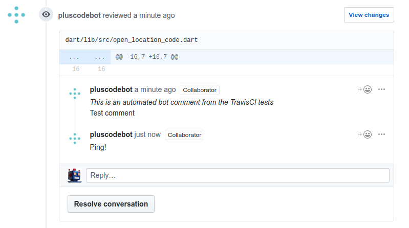

# TravisCI

## TravisCI Integration

We use [TravisCI](https://travis-ci.org/google/open-location-code) to run tests
after each push and pull request.

This uses a separate virtual machine for each configuration (one for Go, one for
Dart, one for Python 2, one for Python 3 etc). This allows the tests to run in
parallel so that they complete faster.

Each library must run unit tests. These tests use the CSV files in 
[`test_data`](https://github.com/google/open-location-code/tree/master/test_data)
to test basic operations, and may have their own hard-coded tests as well.

In addition to unit tests, there can also be code formatting and static analysis
checks.

A pull request will indicate whether the tests have passed or failed. Clicking
through to the test log will show the exact errors, although running the tests
locally is going to be faster.

The code formatting check would be great if it could update the files, but since
it can't directly update your local copy of the repo, this would impose a lot of
merge complexity on users.

Instead, code formatting (and some other checks) will fail the tests, and add
a comment to the pull request using the pull request commenter.

## Pull Request Commenter

`github_comments.go` provides a command line tool to send comments to a GitHub
pull request.

It can add a comment to the pull request conversation, or to a specific file in
the pull request. Comments associated with specific files appear as review
comments.

When commenting on a file, if the file has an existing comment with the same
content, it will simply add a reply with "Ping!".

Cavaets:

 * Comments always appear on the left-hand side of the diff, even though they
   have the latest commit ID. (This appears to be a bug with GitHub API.)
 * Comments will typically appear on the first line of the files (GitHub makes
   it difficult to correctly compute the line number.)
 * Comments may disappear from "Files changed" or "view changes", if the lines
   they are attached to are changed. (They will continue to show in the
   conversation view.)
 * The commenter cannot re-open resolved comments. Even if the problem exists,
   and it replies to it, if someone resolved the comment it won't re-open. (This
   is because the GitHub v3 API doesn't return the resolved status or provide
   a way to change it.)
 * Only files changed by the pull request can have comments. If a comment is
   sent for a file not modified in the pull request, the bot will make a comment
   into the main pull request conversation.
